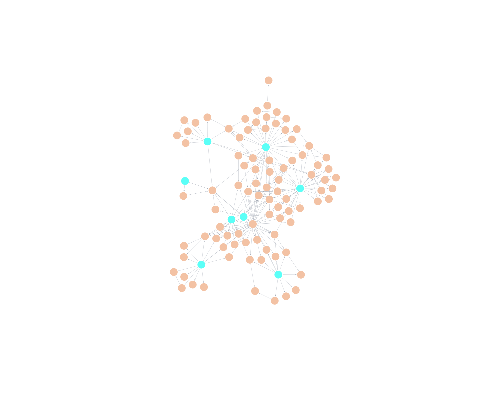

# Neo4j and LangChain Groq RAG Demo

This project demonstrates how to build a Retrieval-Augmented Generation (RAG) system using a Neo4j knowledge graph and the LangChain library with Groq's Llama3 model. The system extracts information from Wikipedia, builds a knowledge graph, and then answers questions based on the structured data in the graph.

## Graph and Node images




## Overview

The core idea is to transform unstructured text data into a structured knowledge graph. This graph represents entities (like people, places, organizations) and their relationships. When a user asks a question, the system first retrieves relevant information from the graph and then uses a Large Language Model (LLM) to generate a human-readable answer based on that retrieved context.

## Features

- **Knowledge Graph Creation**: Automatically builds a knowledge graph from Wikipedia articles using `LLMGraphTransformer`.
- **Neo4j Integration**: Uses Neo4j as the graph database to store and query the knowledge graph.
- **High-Speed Inferencing**: Leverages the Groq API for fast LLM responses.
- **RAG Pipeline**: Implements a RAG pipeline that:
    1. Extracts entities from the user's question.
    2. Retrieves the neighborhood of these entities from the knowledge graph.
    3. Uses the retrieved data as context for an LLM to generate an answer.

## Prerequisites

- Python 3.7+
- A running Neo4j instance (e.g., via Neo4j Desktop or Docker).
- A Groq API key.

## Setup

1.  **Clone the repository:**
    ```bash
    git clone <repository-url>
    cd <repository-directory>/Neo4j
    ```

2.  **Install dependencies:**
    ```bash
    pip install -r requirements.txt
    ```

3.  **Configure Neo4j:**
    - Make sure your Neo4j database is running.
    - Update the connection details in `demo.ipynb` if they are different from the default:
      ```python
      kg = Neo4jGraph(
          url="neo4j://127.0.0.1:7687", 
          username="neo4j", 
          password="user@123", 
          enhanced_schema=True, 
      )
      ```

4.  **Set up environment variables:**
    - Create a file named `.env` in the `Neo4j` directory.
    - Add your Groq API key to the `.env` file:
      ```
      GROQ_KEY=your_groq_api_key_here
      ```

## Usage

1.  **Run the Jupyter Notebook:**
    - Open and run the `demo.ipynb` notebook cell by cell.

2.  **Notebook Workflow:**
    - **Initialization**: The notebook installs necessary packages, imports libraries, and connects to the Neo4j database and the Groq LLM.
    - **Data Wipe**: It cleans the Neo4j database to start fresh.
    - **Data Loading & Processing**: It loads the "Ramayana" article from Wikipedia, splits it into chunks, and transforms it into graph documents.
    - **Graph Ingestion**: The graph documents are added to the Neo4j database.
    - **Indexing**: A full-text index is created on entities to enable efficient searching.
    - **Question Answering**: The notebook defines functions to retrieve data from the graph based on a question and then generate an answer. It runs two example questions at the end.

## Code Overview

-   `LLMGraphTransformer`: A LangChain component that uses an LLM to convert plain text documents into graph structures (nodes and relationships).
-   `Neo4jGraph`: A LangChain wrapper for interacting with a Neo4j database.
-   `generate_full_text_query()`: A helper function to create a fuzzy search query to find entities in the graph even with minor misspellings.
-   `structured_retriever()`: This function takes a user's question, extracts named entities from it, and queries the Neo4j graph to find those entities and their direct relationships.
-   `answer_question()`: The main function that orchestrates the RAG process. It calls the `structured_retriever` to get context and then passes that context along with the original question to the LLM to generate a final answer.
